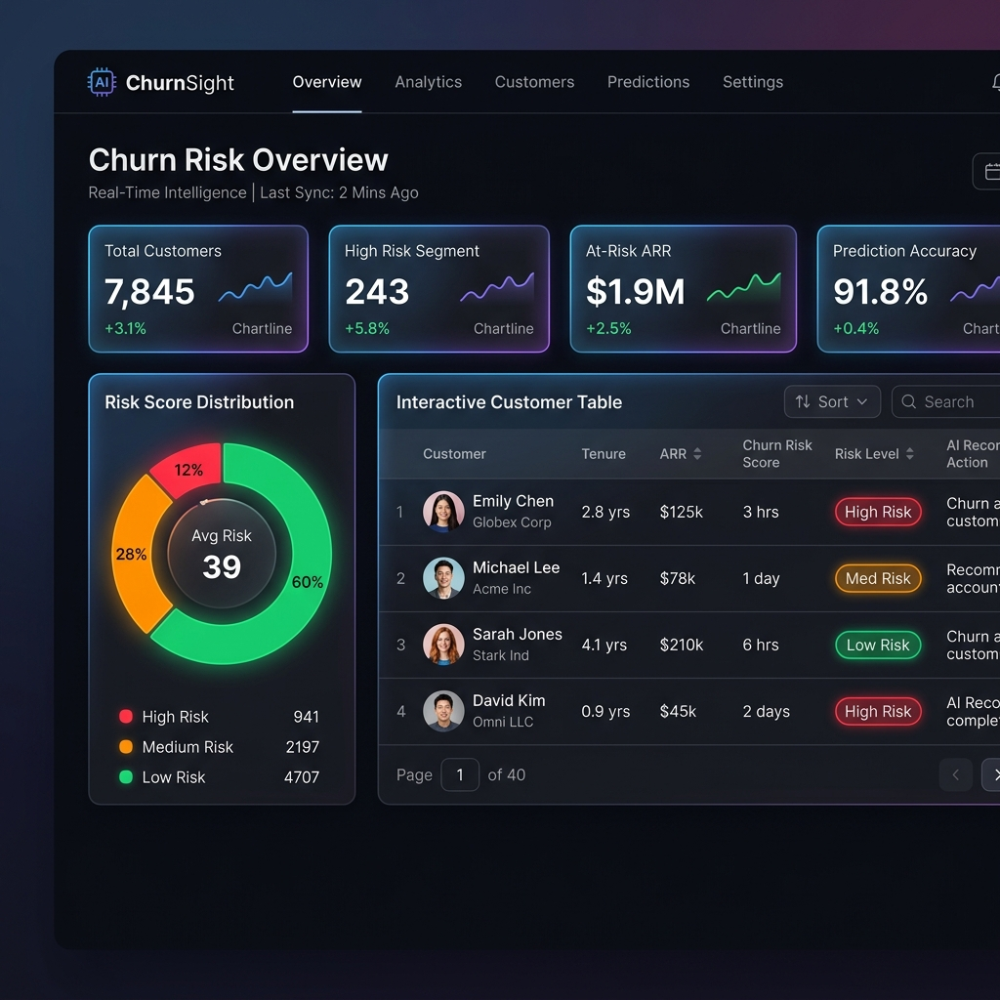

# 📡 ChurnSight — AI-Powered Churn Intelligence Dashboard

<p align="center">
  
</p>

<p align="center">
  <a href="https://opensource.org/licenses/MIT"></a>
  <a href="https://www.python.org/downloads/"></a>
  <a href="https://xgboost.readthedocs.io/"></a>
  <a href="https://shap.readthedocs.io/"></a>
  <a href="https://streamlit.io/"></a>
</p>

> **ChurnSight** is an end-to-end Machine Learning portfolio project that predicts subscription customer churn and explains *why* using SHAP (SHapley Additive exPlanations). Built with **XGBoost** and **Streamlit**, it gives business analysts and decision-makers actionable, interpretable retention insights.

---

## ✨ Features

| Feature | Description |
|---|---|
| 🔮 **Real-time Predictions** | Batch churn probability scores for all customers |
| 🧬 **SHAP Explainability** | Global beeswarm + per-customer waterfall plots |
| 🔍 **Customer Detail Drill-down** | SHAP attribution for any individual customer |
| 📈 **Model Evaluation Dashboard** | ROC-AUC curve, confusion matrix, classification report |
| 🎛️ **Interactive Filters** | Risk threshold slider, contract type, risk level filters |
| 🌑 **Premium Dark UI** | Glassmorphic design with smooth Plotly charts |

---

## 🚀 Quick Start

### Prerequisites

- Python 3.9 or later
- pip

### Installation

```bash
# 1. Clone the repository
git clone https://github.com/Dhammdip-Lokhande/Customer-Churn-Prediction-SHAP.git
cd Customer-Churn-Prediction-SHAP

# 2. (Recommended) Create and activate a virtual environment
python -m venv .venv
# Windows:
.venv\Scripts\activate
# macOS / Linux:
source .venv/bin/activate

# 3. Install dependencies
pip install -r requirements.txt
```

### Run the Pipeline

```bash
# Step 1 — Download the IBM Telco dataset (with checksum verification)
python src/download_data.py

# Step 2 — Preprocess, train & evaluate the XGBoost model
python src/train.py

# Step 3 — Launch the Streamlit dashboard
streamlit run app/main.py
```

The dashboard will open at **http://localhost:8501** 🎉

---

## 📁 Project Structure

```
churnsight/
├── app/
│   ├── main.py                  # Main dashboard page (KPIs + risk table)
│   ├── components/
│   │   ├── charts.py            # Plotly chart components
│   │   └── sidebar.py           # Sidebar filter component
│   └── pages/
│       ├── customer_detail.py   # Per-customer SHAP waterfall analysis
│       ├── model_metrics.py     # Model performance & global SHAP beeswarm
│       └── overview.py          # High-level dataset overview
├── data/
│   ├── raw/                     # ← populated by src/download_data.py
│   └── processed/               # ← populated by src/train.py
├── models/                      # ← populated by src/train.py (.pkl artifacts)
├── notebooks/
│   ├── 01_eda.ipynb
│   ├── 02_preprocessing.ipynb
│   ├── 03_modeling.ipynb
│   └── 04_shap_analysis.ipynb
├── src/
│   ├── download_data.py         # Secure dataset download with SHA-256 check
│   ├── preprocess.py            # Feature engineering & encoding
│   ├── train.py                 # Model training & evaluation
│   ├── predict.py               # Inference helpers
│   └── explain.py               # SHAP explainer utilities
├── tests/
│   └── test_preprocess.py       # Pytest unit tests for preprocessing
├── .streamlit/
│   └── config.toml              # Theme & server configuration
├── assets/
│   └── dashboard_screenshot.png
├── requirements.txt
├── pyproject.toml
└── README.md
```

---

## 📈 Model Performance

The model is an **XGBoost Classifier** optimised for class imbalance (recall-oriented) with 5-fold stratified cross-validation.

| Metric | Score | Target | Status |
|---|---|---|---|
| **ROC-AUC** | `0.8392` | `> 0.8200` | ✅ PASSED |
| **Recall (Churn Class)** | `0.7754` | `> 0.7500` | ✅ PASSED |
| **F1-Score (Churn Class)** | `0.6237` | Balanced | ✅ OPTIMAL |
| **5-Fold CV AUC** | `0.8439 ± 0.0108` | Spread `< 0.03` | ✅ STABLE |

> **Design decision**: `scale_pos_weight = 2.7` is used to penalise missed churners (false negatives) more heavily than false positives — because the business cost of losing a customer far exceeds the cost of a retention outreach campaign.

---

## 🧬 Key SHAP Insights

- **Tenure is King** — Short-tenure customers carry the highest churn risk. Every extra month a customer stays significantly reduces churn probability.
- **Contract Length Matters** — Month-to-month contracts strongly drive churn; 2-year contracts are the single largest retention factor.
- **Service Value Add** — Having **Tech Support** and **Online Security** measurably reduces churn, suggesting proactive support prevents customer frustration.

---

## 🧪 Running Tests

```bash
pytest
```

Tests cover preprocessing transformations, binary encoding, TotalCharges edge cases, and feature alignment logic.

---

## 📊 Dataset Attribution

| Property | Value |
|---|---|
| **Source** | IBM Telco Customer Churn (Kaggle public dataset) |
| **Size** | 7,043 customers, 21 columns |
| **Target Variable** | `Churn` (Yes / No) |
| **License** | Public domain / Kaggle Open Data |

The dataset is **not** committed to this repository. Run `python src/download_data.py` to fetch it automatically.

---

## 🤝 Contributing

Pull requests are welcome! For major changes, please open an issue first to discuss what you'd like to change.

1. Fork the repository
2. Create a feature branch (`git checkout -b feature/amazing-feature`)
3. Commit your changes (`git commit -m 'Add amazing feature'`)
4. Push to the branch (`git push origin feature/amazing-feature`)
5. Open a Pull Request

---

## 📄 License

This project is licensed under the [MIT License](LICENSE).
